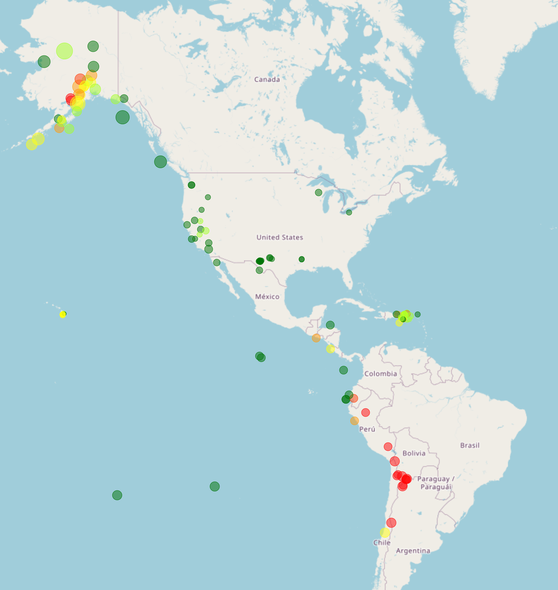
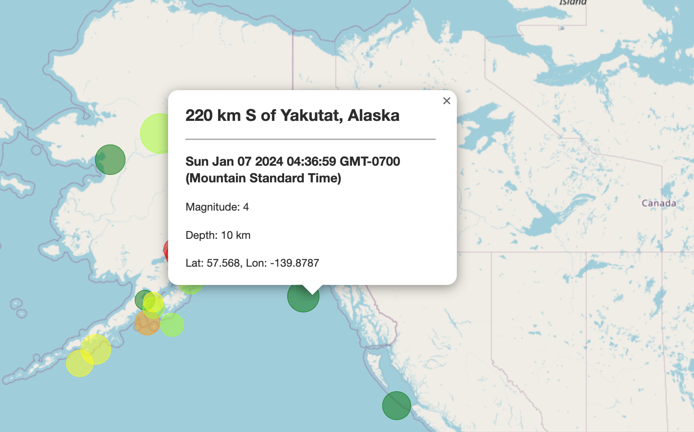

# leaflet-challenge

For our 15th module challenge, we set out to plot earthquake data using JavaScript's Leaflet libraries. 

### Overview

The module's data source was the USGS's GeoJSON feed: http://earthquake.usgs.gov/earthquakes/feed/v1.0/geojson.php

Once there, I tested a few different data sets to see which one showed best on the map at this scale. I landed on the file that provided data for earthquake events with magnitudes greater than 2.5 over the past 7 days (M2.5+ Earthquakes). 

### Process

After selecting a dataset, D3 libraries were used to call the api and console log was used to render it into the browser's inspector. 

First, a function for the marker size was created. Next, the 6-steps were provided and I selected a color scale that differentiated the plots, by depth. 

Then, a popup with information about each marker was bound to the layer: 

Next, we created the earthquake layer with the markers bound to it. 

Following that, we had to create a base layer. We've been doing this with openstreetmaps.org for our class activities, so I used the same street map from those examples. 

Finally, an info pannel and legend with color scale were added. 

### Conclusion

This was a great exercise to learn how to construct an interactive map. Companies often use these types of visualizations to help communicate information. It will make a great addition to my project portfolio!
